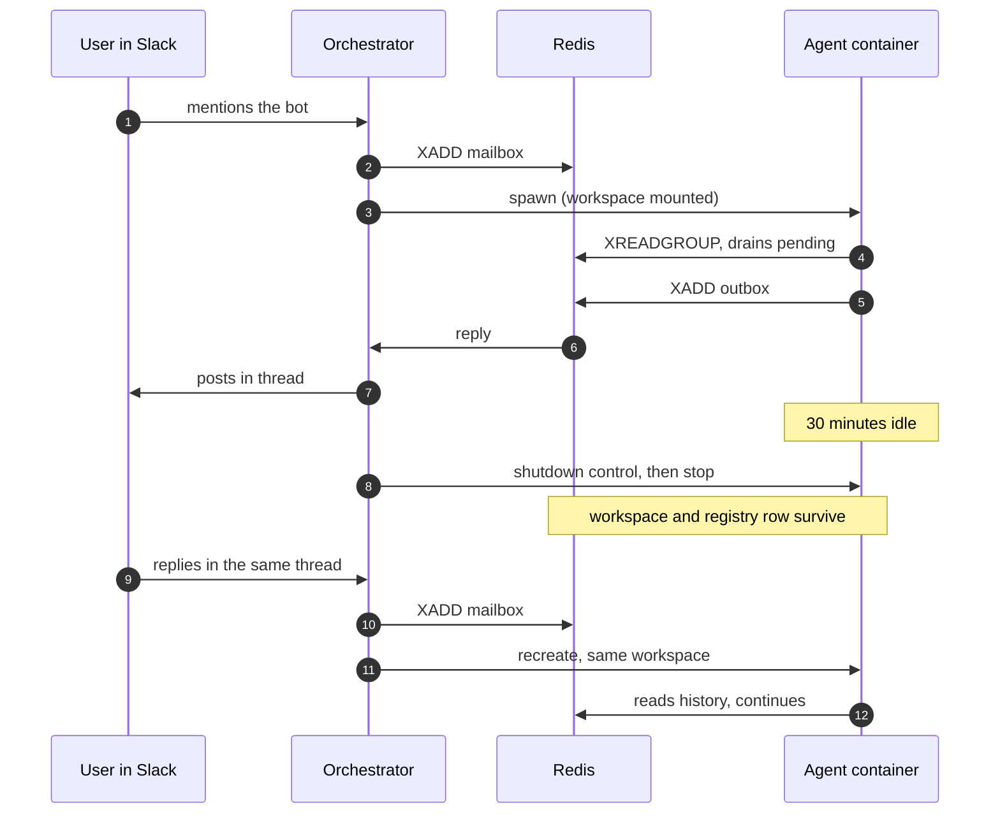

<p align="center">
  
</p>

<h1 align="center">Cerberus</h1>

<p align="center">
  Container-per-Slack-thread orchestrator.<br>
  Every thread gets its own isolated agent container, with memory that survives it.
</p>

---

Cerberus treats each Slack thread as a durable actor. The thread owns the identity, the container is just the runtime it happens to be using, and the workspace is its memory. Containers are stopped when idle and recreated transparently on the next message, with the conversation intact.

A single privileged orchestrator holds the Slack tokens and the container runtime. Agents hold neither.

## Quickstart

### Prerequisites

- **Docker** 20.10 or newer, for the orchestrator, Redis, Postgres, and agent containers
- **pnpm** 9, and Node 22 for local development
- A **Slack app** with Socket Mode enabled:
  - OAuth scopes: `app_mentions:read`, `chat:write`, `channels:history`, `reactions:write` (the last one powers the instant :eyes: acknowledgement)
  - Bot events: `app_mention`, `message.channels`
  - An app-level token with `connections:write`

### Setup

```bash
pnpm install
pnpm build:agent-image

cd deploy
cp .env.example .env          # add SLACK_BOT_TOKEN and SLACK_APP_TOKEN
docker compose up --build
```

Then mention the bot in a Slack channel. The first mention spawns a `cerberus-agent-*` container for that thread; replies in the same thread route back to it without needing another mention. After 30 idle minutes the container stops, and the next reply recreates it with its history.

The console, health endpoints, and metrics are all served at `http://localhost:8080`.

## Console

Open `http://localhost:8080` for a live view of the fleet.

**Overview** shows counts (running, provisioning, stopped, failed, recent) above a card per thread. Each card carries the channel, thread time, status, a heartbeat dot that goes hollow when the agent stops checking in, and a stat line with mailbox depth, time since last activity, and whether the container is up.

**Agent detail** shows the lifecycle table (created, last activity, container name and id, workspace path, mailbox depth, failures), the conversation read from the thread's workspace, a capabilities panel, and Stop / Restart controls that act on the real container.

**Log drawer** streams that container's raw output with pause, resume, a substring filter, and copy. Pausing buffers rather than drops, so resuming loses nothing.

Updates arrive two ways. Lifecycle events (spawn, reap, message routed) push a fresh snapshot within about 100ms, and a 2 second reconcile tick catches what the orchestrator emits no event for, such as a container dying on its own, mailbox depth, or an expired heartbeat. Log lines are batched before sending so a chatty agent cannot flood the socket.

Everything flows over one `/api/stream` WebSocket, with a REST surface under `/api/*` as a fallback. `/healthz`, `/readyz`, and `/metrics` are matched *before* the console's SPA fallback, so probes and scrapes are never shadowed by it.

> **Capabilities are a preview.** Tool toggles, the model picker, and the resource sliders persist to Postgres and survive reloads, but the runtime does not read them yet. The panel says so itself. When a real agent brain replaces the stub, the supervisor will read that table when building the container spec.

> **Security.** The console inherits the orchestrator's privileges: it can stop and restart containers and read every thread's conversation. Cross-origin mutating requests are rejected, but that is not a substitute for auth. Set `DASHBOARD_TOKEN` on any host other people can reach. Log access equals conversation access.

## Architecture

Cerberus is an actor model dressed as infrastructure:

| Concept | Where it lives | Lifetime |
|---|---|---|
| Thread (the actor) | Postgres registry | Permanent |
| Mailbox | Redis stream `mailbox:<threadKey>` | Until consumed |
| Container (the runtime) | Docker or Kubernetes | Disposable |
| Workspace (the memory) | Bind mount or PVC | Survives the container |

### System


The message is written to the mailbox *before* any container work happens. If a spawn is slow or fails, the message waits in the stream rather than being lost.

### Thread lifecycle



### Guarantees and how they hold

- **Messages are not lost.** The mailbox is written first, and the consumer group redelivers unacked entries after a crash. An agent that dies mid-message replays it on restart.
- **Replies are not duplicated.** A delivery guard claims each outbound id before posting, so at-least-once stream delivery does not become at-least-once Slack posts.
- **Events are not double-handled.** Dedup is keyed on message identity, which collapses both Slack retries and the app_mention plus message double delivery.
- **Restarts are safe.** A boot-time reconciler diffs the registry against what is actually running and repairs the drift. Agents are deliberately left running when the orchestrator restarts.

### Security model

- Agents receive exactly four environment variables: `THREAD_KEY`, `REDIS_URL`, `WORKSPACE_PATH`, `LOG_LEVEL`. No Slack tokens, no Docker socket.
- Agent containers run with a read-only root filesystem, all Linux capabilities dropped, no-new-privileges, a non-root user, and CPU, memory, and PID limits.
- A Redis ACL restricts the `agent` user to `mailbox:*`, `outbox`, and `heartbeat:*`.
- Agents sit on an isolated network with no inbound ports. Kubernetes adds a NetworkPolicy that permits only Redis and DNS egress.

Design decisions are recorded in [`docs/superpowers/specs/2026-07-18-cerberus-design.md`](docs/superpowers/specs/2026-07-18-cerberus-design.md) and [`docs/superpowers/specs/2026-07-19-cerberus-console-design.md`](docs/superpowers/specs/2026-07-19-cerberus-console-design.md). Original requirements are in [`spec.md`](spec.md).

## Testing

```bash
pnpm test              # unit suite, server and browser
pnpm test:integration  # real Redis, Postgres, and Docker via testcontainers
pnpm typecheck
```

Unit tests run against in-memory fakes of every external dependency. Integration tests spin up real services, and the runtime and log-streaming tests drive a real Docker daemon. The end-to-end test exercises the whole path: a synthetic mention spawns a container, the reply comes back through the outbox, the container is killed mid-conversation, and the recreated agent continues with its memory intact.

The browser code is covered where it earns it: the WebSocket client's reconnect backoff, resubscription, channel reference counting, and log ordering all have tests. The rest of the UI is verified by driving the running console.

```bash
pnpm build:dashboard                      # build the console bundle
pnpm --filter @cerberus/dashboard dev     # console with hot reload against a running orchestrator
```

## Configuration

Loaded from `deploy/.env`. Values without a default are required.

| Variable | Default | Notes |
|---|---|---|
| `SLACK_BOT_TOKEN` | | Bot token, `xoxb-...` |
| `SLACK_APP_TOKEN` | | App-level token, `xapp-...` |
| `DATABASE_URL` | | Postgres connection string, set by compose |
| `REDIS_URL` | | Orchestrator's Redis connection, set by compose |
| `AGENT_REDIS_URL` | | Redis URL as reachable from inside agent containers |
| `RUNTIME` | `docker` | `docker` for local development, `k8s` for Kubernetes |
| `AGENT_IMAGE` | `cerberus-agent:dev` | Image used for spawned agents |
| `AGENT_NETWORK` | `cerberus-agents` | Docker network agents attach to |
| `IDLE_TIMEOUT_MS` | `1800000` | 30 minutes before an idle container is reaped |
| `MAX_CONCURRENT_AGENTS` | `50` | Backpressure cap; further threads queue |
| `AGENT_CPU` / `AGENT_MEMORY_MB` / `AGENT_PIDS_LIMIT` | `0.5` / `512` / `256` | Per-agent resource limits |
| `WORKSPACES_ROOT` | `/workspaces` | Where workspaces live inside the orchestrator |
| `WORKSPACES_HOST_ROOT` | | Host path prefix for Docker bind mounts |
| `DASHBOARD_ENABLED` | `true` | Set `false` to disable the console; health and metrics keep working |
| `DASHBOARD_TOKEN` | | When set, REST needs `Authorization: Bearer <token>` and the console URL needs `?token=<token>` |
| `DASHBOARD_DIST` | | Override the built dashboard directory |
| `LOG_LEVEL` | `info` | `debug`, `info`, `warn`, `error` |

## Project structure

```
cerberus/
  assets/logo.svg
  packages/
    protocol/          Shared types: agent messages and console wire types
    orchestrator/      Slack gateway, registry, runtime, lifecycle, console API
      src/api/         REST routes, static serving, WebSocket hub, snapshots, event bus
    agent/             Agent container entry point and swappable Brain
    dashboard/         Cerberus Console (React, Vite, Tailwind)
  deploy/
    docker-compose.yml Local stack
    k8s/               Kubernetes manifests (RBAC, NetworkPolicy, PVC)
    redis/users.acl    Redis ACL isolating the agent user
  docs/superpowers/    Design specs and implementation plans
  spec.md              Original requirements
```

## Observability

Structured JSON logs on stdout, every line tagged with `threadKey`.

```bash
docker compose logs -f orchestrator
docker logs -f $(docker ps -q --filter label=cerberus.role=agent)
```

Prometheus metrics on `/metrics`:

| Metric | Type | Meaning |
|---|---|---|
| `cerberus_active_agents` | gauge | Running agent containers |
| `cerberus_agent_spawns_total{outcome}` | counter | Spawn outcomes: spawned, already-running, deferred, failed |
| `cerberus_messages_inbound_total` | counter | Slack messages routed to mailboxes |
| `cerberus_messages_outbound_total` | counter | Agent replies posted to Slack |
| `cerberus_agents_reaped_total` | counter | Idle agents stopped |
| `cerberus_slack_errors_total` | counter | Slack API failures |

Health: `GET /healthz` reports that the process is alive, `GET /readyz` checks Redis and Postgres and returns 503 when either is unreachable.

## Troubleshooting

**No container spawns.** Check `docker compose logs orchestrator | grep spawn`, and confirm the socket is reachable at `/var/run/docker.sock`.

**Nothing arrives from Slack.** Confirm Socket Mode is enabled and that both `app_mention` and `message.channels` are subscribed *and saved* under Event Subscriptions. An unsaved subscription is the usual culprit. Then check whether the outbox is backing up:

```bash
docker compose exec redis redis-cli --user orchestrator --pass orchestrator-dev-password XLEN outbox
```

**Agents fail with NOAUTH or NOPERM.** Verify the ACL loaded:

```bash
docker compose exec redis redis-cli --user orchestrator --pass orchestrator-dev-password ACL LIST
```

**The log drawer says the stream ended.** That is the container reporting why. "container exited" means the agent is gone, so press Restart. A stopped thread has no logs to stream because there is no container.

## Deployment

Kubernetes uses the same code path with `RUNTIME=k8s`, swapping the Docker runtime for pod-per-thread. Manifests are in `deploy/k8s/`: namespace, RBAC scoped to pods in its own namespace, Redis, Postgres, a shared RWX workspace PVC, the orchestrator, and a NetworkPolicy limiting agents to Redis and DNS. Message transport and the console are identical; only container spawning differs.

## Status

The orchestration, console, and safety machinery are real and tested. The agent brain is not: `StubBrain` echoes messages back and maintains conversation history. It sits behind a `Brain` interface so a real implementation drops in without touching the orchestrator.

## License

Not yet chosen.
