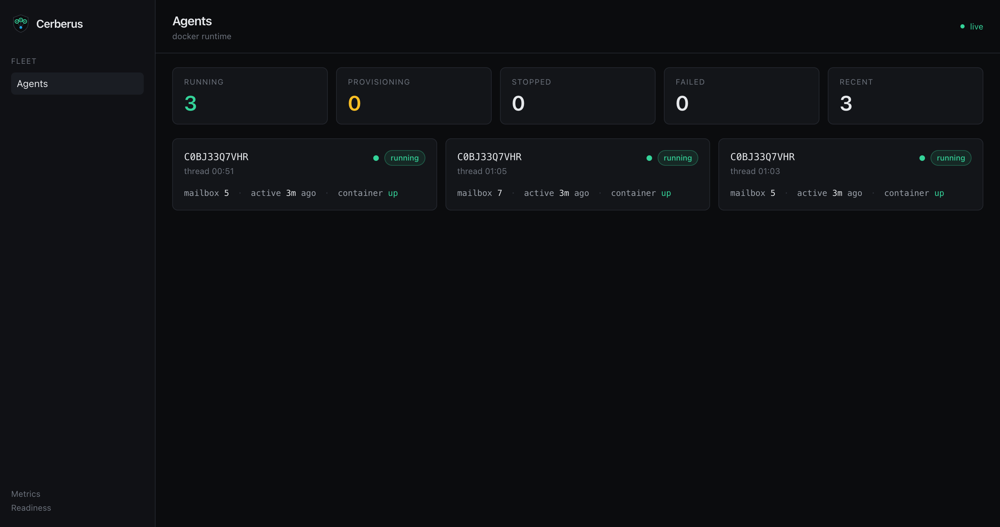
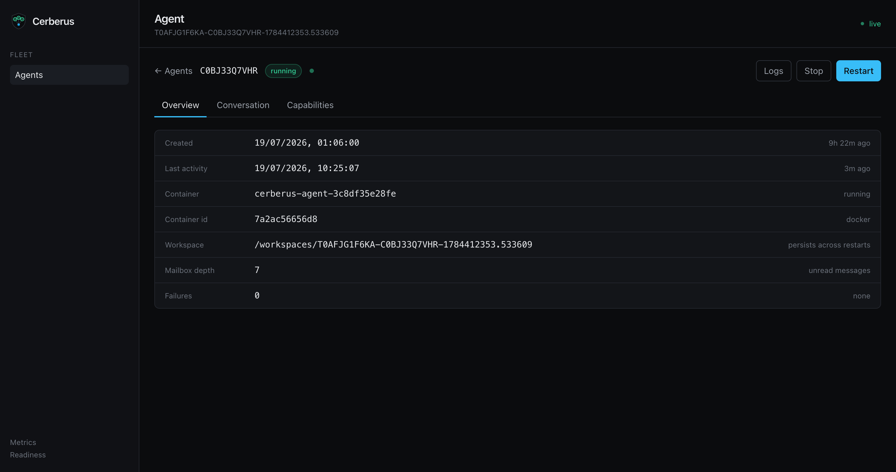
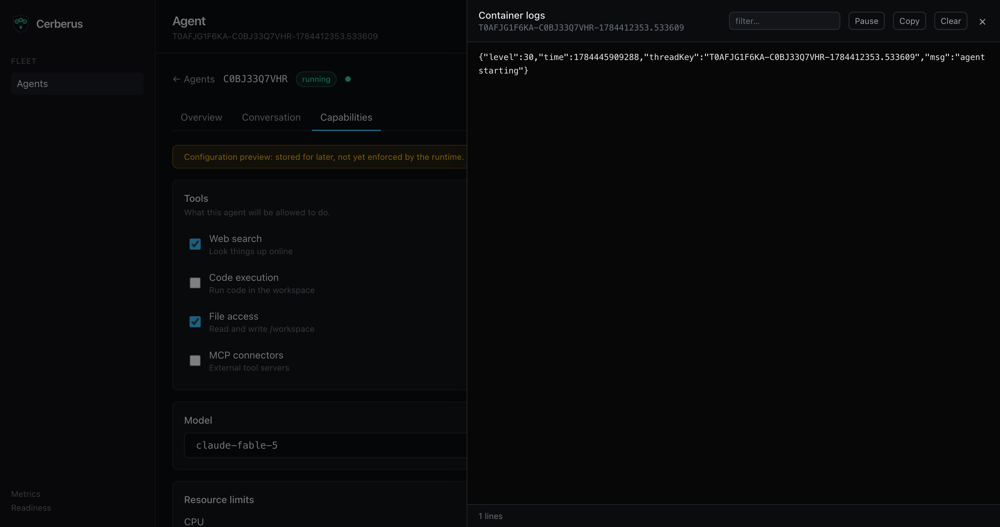
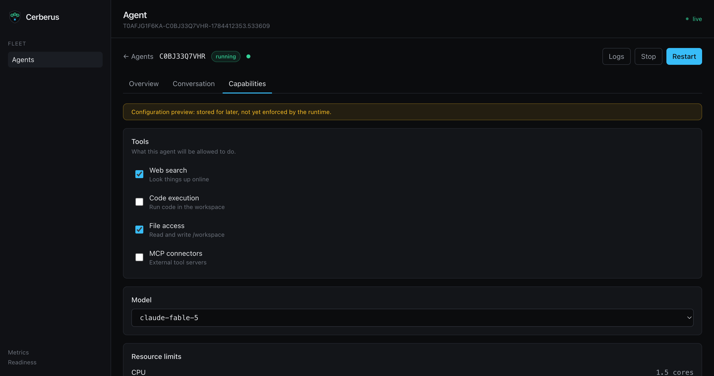
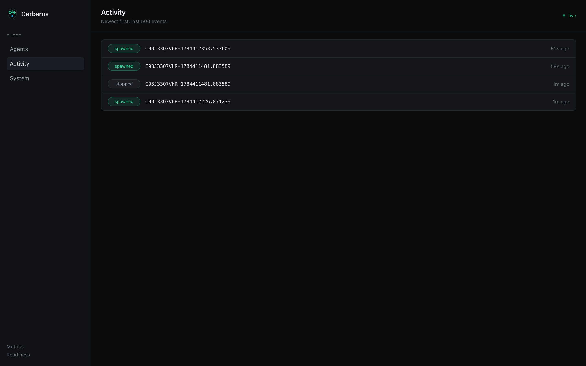
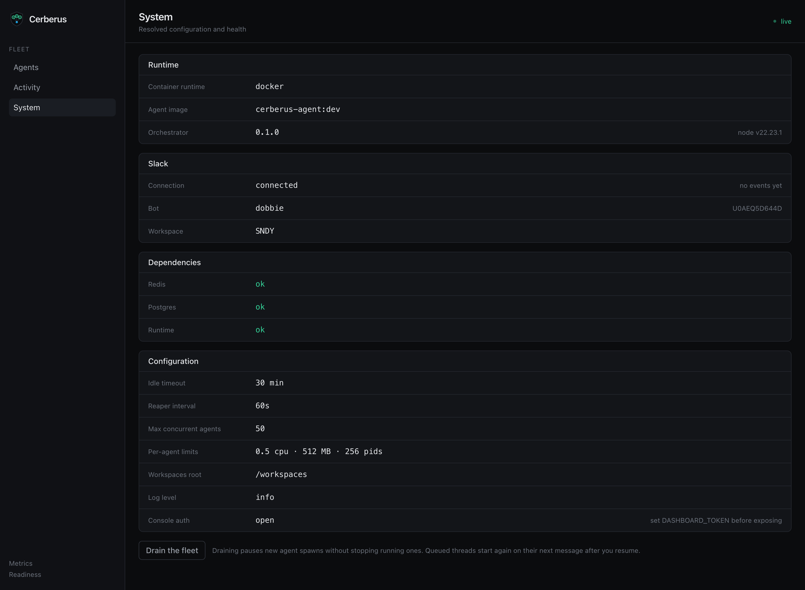
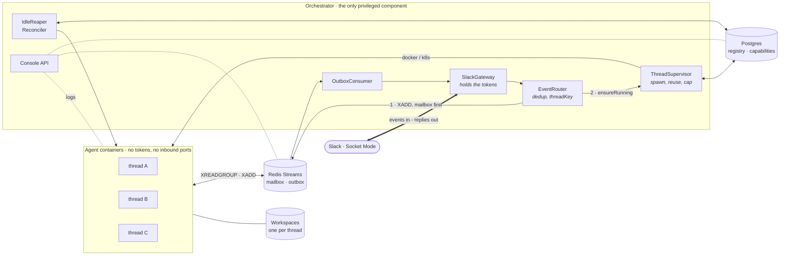
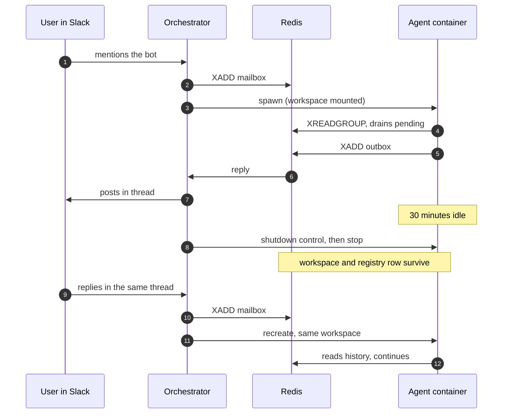

<p align="center">
  
</p>

<h1 align="center">Cerberus</h1>

<p align="center">
  <b>One Slack thread. One isolated container. Memory that outlives it.</b>
</p>

<p align="center">
  
  
  
  
  
  
</p>

<p align="center">
  
</p>

<p align="center"><i>The console: every Slack thread in the fleet, live.</i></p>

---

Most Slack bots are one process handling every conversation, sharing memory and blast radius. Cerberus inverts that. Each thread becomes a **durable actor** with its own container, its own filesystem, and its own lifecycle. The container is disposable. The thread is not.

Mention the bot and a container spawns for that thread. Reply and it routes back to the same one. Leave it alone for thirty minutes and it is reaped to free resources. Reply again and it comes back with the entire conversation intact, because the memory was never in the container to begin with.

A single privileged orchestrator holds the Slack tokens and the container runtime. **Agents hold neither.**

> [!NOTE]
> The orchestration is real, tested, and running. The intelligence is not: agents currently run `StubBrain`, which echoes. It sits behind a `Brain` interface so a real implementation drops in without the orchestrator noticing. See [Status and roadmap](#status-and-roadmap).

## Contents

- [Quick start](#quick-start)
- [What it looks like](#what-it-looks-like)
- [Examples](#examples)
- [Architecture](#architecture)
- [Guarantees](#guarantees-and-how-they-hold)
- [Security model](#security-model)
- [Configuration](#configuration)
- [Observability](#observability)
- [Testing](#testing)
- [Project history](#project-history)
- [FAQ](#faq)
- [Status and roadmap](#status-and-roadmap)

## Quick start

**Prerequisites:** Docker 20.10+, pnpm 9, Node 22, and a Slack app with Socket Mode enabled.

Slack app setup, once:

| Setting | Value |
|---|---|
| Bot token scopes | `app_mentions:read`, `chat:write`, `channels:history`, `reactions:write` |
| Bot events | `app_mention`, `message.channels` |
| App-level token scope | `connections:write` |
| Socket Mode | On |

```bash
pnpm install
pnpm build:agent-image

cd deploy
cp .env.example .env      # add SLACK_BOT_TOKEN and SLACK_APP_TOKEN
docker compose up --build
```

Invite the bot to a channel and mention it. That is the whole setup: no public URL, no ngrok, no webhook endpoint. Socket Mode dials out from the orchestrator.

> [!WARNING]
> Two things bite everyone. First, adding bot events under **Event Subscriptions** does nothing until you press **Save Changes**; an unsaved subscription is silent. Second, adding scopes requires a **reinstall** before they take effect.

## What it looks like

Mention the bot, and within a second or two:

```
adi  10:24
@Dobbie are you alive?
     👀                                    ← reaction lands immediately

Dobbie  APP  10:24
_thinking…_                               ← posted while the agent works
Echo: are you alive? (user message #1 in this thread)
```

Meanwhile, on the host:

```console
$ docker ps --filter label=cerberus.role=agent --format '{{.Names}}\t{{.Status}}'
cerberus-agent-3c8df35e28fe   Up 4 seconds
```

### Agent detail

Drill into any thread for its lifecycle, container identity, workspace path, mailbox depth, and the conversation itself, with Stop and Restart acting on the real container.

<p align="center">
  
</p>

### Live logs

The log drawer tails that container's stdout over the same WebSocket, batched so a chatty agent cannot flood the socket. Pause buffers rather than drops, so resuming loses nothing.

<p align="center">
  
</p>

### Capabilities

Per-agent tool toggles, model, and resource limits. Stored in Postgres, surviving reloads, and honestly labelled: the runtime does not read them yet.

<p align="center">
  
</p>

### Activity

A fleet-wide, chronological feed of what just happened: spawns, stops, failures, routed messages, and posted replies, each with a relative timestamp and the thread it belongs to. It is backed by an in-memory ring buffer capped at 500 events, pushed over the WebSocket as deltas. Deliberately not persisted: this view answers "what just happened," and a restart clearing it is acceptable.

<p align="center">
  
</p>

### System

Read-only deployment state: runtime and agent image, orchestrator and Node versions, the safe subset of config, Slack's connection state and resolved bot identity, and dependency health for Redis, Postgres, and the runtime. No secret ever reaches this payload: the dashboard token appears only as a boolean. It also carries the drain switch, which pauses new agent spawns without stopping running ones, for deploys.

<p align="center">
  
</p>

## Examples

### Talk to a thread's agent

Everything is driven from Slack. A mention opens a thread; replies in that thread route to the same container without needing another mention.

```
@bot summarise this incident        → spawns a container for the thread
   ↳ what about the rollback?        → same container, same memory
   ↳ (30 minutes pass, reaped)
   ↳ still there?                    → recreated, history intact
```

### Inspect the fleet from the shell

```bash
# Whole fleet, one line per agent
curl -s localhost:8080/api/overview | jq -r '
  .agents[] | "\(.status)\t\(.containerRunning)\t\(.mailboxDepth)\t\(.threadKey)"'

# One thread in full, including its conversation
curl -s "localhost:8080/api/threads/$(jq -rn --arg k "$KEY" '$k|@uri')" | jq

# Tail a container's logs without the browser
curl -s "localhost:8080/api/threads/$(jq -rn --arg k "$KEY" '$k|@uri')/logs?tail=50" \
  | jq -r '.lines[]' | jq -r '.msg? // .'
```

### Stop and restart an agent

```bash
KEY=T012ABC-C345DEF-1712345678.000100
ENC=$(jq -rn --arg k "$KEY" '$k|@uri')

curl -s -X POST "localhost:8080/api/threads/$ENC/stop"     # graceful stop
curl -s -X POST "localhost:8080/api/threads/$ENC/restart"  # {"outcome":"spawned"}
```

The thread survives both. Its workspace and registry row are untouched, so the next message picks up where it left off.

### Configure capabilities

```bash
curl -s -X PUT "localhost:8080/api/threads/$ENC/capabilities" \
  -H 'content-type: application/json' \
  -d '{
        "tools": { "web_search": true, "code_execution": false,
                   "file_access": true, "mcp_connectors": false },
        "model": "claude-fable-5",
        "cpu": 1.5, "memoryMb": 2048, "pidsLimit": 512
      }'
```

Rejected with `400` if the shape is wrong, `404` if the thread does not exist. Values persist; the runtime does not consult them yet.

### Watch the fleet over the WebSocket

The console uses one socket for everything. So can you:

```js
const ws = new WebSocket('ws://localhost:8080/api/stream');
ws.onopen = () => {
  ws.send(JSON.stringify({ type: 'subscribe', channel: 'overview' }));
  ws.send(JSON.stringify({ type: 'subscribe', channel: `logs:${KEY}` }));
};
ws.onmessage = (e) => {
  const msg = JSON.parse(e.data);
  if (msg.type === 'snapshot') console.log(msg.data.counts);
  if (msg.type === 'log') msg.lines.forEach((l) => console.log(l));
  if (msg.type === 'log_end') console.log('ended:', msg.reason);
};
```

Channels are `overview`, `activity`, `thread:<threadKey>`, and `logs:<threadKey>`.

### Swap in a real brain

The agent's intelligence is one interface. Implement it and the orchestrator needs no changes:

```ts
// packages/agent/src/brain/brain.ts
export interface Brain {
  process(msg: AgentInbound, ctx: BrainContext): AsyncIterable<AgentOutbound>;
}
```

```ts
// A real brain, sketched
export class ClaudeBrain implements Brain {
  async *process(msg: AgentInbound, ctx: BrainContext) {
    yield { id: ulid(), inReplyTo: msg.id, threadKey: msg.threadKey,
            kind: 'status', text: '_thinking…_', final: false };

    const answer = await callTheModel(msg.text, ctx.history, ctx.workspacePath);

    yield { id: ulid(), inReplyTo: msg.id, threadKey: msg.threadKey,
            kind: 'message', text: answer, final: true };
  }
}
```

Yield as often as you like. Non-final messages are progress; the final one closes the turn. `ctx.history` is the thread's conversation, and `ctx.workspacePath` is a writable directory that outlives the container.

### Run on Kubernetes

Same code path, pod per thread:

```bash
kubectl apply -f deploy/k8s/
kubectl -n cerberus create secret generic cerberus-slack \
  --from-literal=SLACK_BOT_TOKEN=xoxb-... \
  --from-literal=SLACK_APP_TOKEN=xapp-...
```

`RUNTIME=k8s` swaps `DockerRuntime` for `K8sRuntime` behind the same `AgentRuntime` interface. Transport, console, and registry are identical.

## Architecture

Cerberus is an actor model dressed as infrastructure:

| Concept | Where it lives | Lifetime |
|---|---|---|
| Thread (the actor) | Postgres registry | Permanent |
| Mailbox | Redis stream `mailbox:<threadKey>` | Until consumed |
| Container (the runtime) | Docker or Kubernetes | Disposable |
| Workspace (the memory) | Bind mount or PVC | Survives the container |



The message is written to the mailbox **before** any container work happens. If a spawn is slow or fails, the message waits in the stream rather than evaporating.

### Thread lifecycle



### Why Redis Streams and not HTTP

The actor model calls the inbox a mailbox, so it is one. Agents need **zero inbound networking**: no ports, no service discovery, no readiness races. A message sent while a container is dead or mid-recreate simply waits in the stream. The same transport works unchanged for both the Docker and Kubernetes runtimes, because an agent only ever needs a `REDIS_URL`.

## Guarantees and how they hold

| Guarantee | Mechanism |
|---|---|
| Messages are not lost | Mailbox written before spawn; consumer group redelivers unacked entries after a crash |
| Replies are not duplicated | A delivery guard claims each outbound id before posting to Slack |
| Events are not double-handled | Dedup keyed on message identity, collapsing Slack retries and the `app_mention` plus `message` double delivery |
| Restarts are safe | A boot-time reconciler diffs the registry against reality and repairs drift; agents are left running |
| A bad thread cannot blank the fleet | Snapshots settle per agent, so one failure drops one card, not the view |

## Security model

- Agents receive exactly four environment variables: `THREAD_KEY`, `REDIS_URL`, `WORKSPACE_PATH`, `LOG_LEVEL`. No Slack tokens. No Docker socket.
- Containers run read-only root, all capabilities dropped, `no-new-privileges`, non-root uid, with CPU, memory, and PID limits.
- A Redis ACL confines the `agent` user to `mailbox:*`, `outbox`, and `heartbeat:*`.
- Agents sit on an isolated network with no inbound ports. Kubernetes adds a NetworkPolicy allowing only Redis and DNS egress.
- The console rejects cross-origin mutating requests, caps request bodies, and compares its token in constant time.

> [!WARNING]
> The console carries the orchestrator's privileges: it can stop containers and read every conversation. Port 8080 is published on all interfaces. **Set `DASHBOARD_TOKEN` on any host other people can reach.** Log access equals conversation access.

## Configuration

Loaded from `deploy/.env`. Values without a default are required.

| Variable | Default | Notes |
|---|---|---|
| `SLACK_BOT_TOKEN` | | Bot token, `xoxb-...` |
| `SLACK_APP_TOKEN` | | App-level token, `xapp-...` |
| `DATABASE_URL` | | Postgres connection string, set by compose |
| `REDIS_URL` | | Orchestrator's Redis connection, set by compose |
| `AGENT_REDIS_URL` | | Redis URL as reachable from inside agent containers |
| `RUNTIME` | `docker` | `docker` locally, `k8s` for pod-per-thread |
| `AGENT_IMAGE` | `cerberus-agent:dev` | Image used for spawned agents |
| `AGENT_NETWORK` | `cerberus-agents` | Docker network agents attach to |
| `IDLE_TIMEOUT_MS` | `1800000` | 30 minutes before an idle container is reaped |
| `MAX_CONCURRENT_AGENTS` | `50` | Backpressure cap; further threads queue |
| `AGENT_CPU` / `AGENT_MEMORY_MB` / `AGENT_PIDS_LIMIT` | `0.5` / `512` / `256` | Per-agent limits |
| `WORKSPACES_ROOT` | `/workspaces` | Workspace root inside the orchestrator |
| `WORKSPACES_HOST_ROOT` | | Host path prefix for Docker bind mounts |
| `DASHBOARD_ENABLED` | `true` | `false` disables the console; health and metrics keep working |
| `DASHBOARD_TOKEN` | | When set, REST needs `Authorization: Bearer`, the console URL needs `?token=` |
| `DASHBOARD_DIST` | | Override the built dashboard directory |
| `LOG_LEVEL` | `info` | `debug`, `info`, `warn`, `error` |

## Project structure

```
cerberus/
  assets/              Logo and console screenshots
  packages/
    protocol/          Shared types: agent messages and console wire types
    orchestrator/      Slack gateway, registry, runtime, lifecycle, console API
      src/api/         REST routes, static serving, WebSocket hub, snapshots, event bus
      src/lifecycle/   Supervisor, idle reaper, reconciler, keyed mutex
      src/runtime/     AgentRuntime interface, Docker and Kubernetes backends
    agent/             Container entry point and the swappable Brain
    dashboard/         Cerberus Console (React, Vite, Tailwind)
  deploy/
    docker-compose.yml Local stack
    k8s/               Namespace, RBAC, NetworkPolicy, PVC, workloads
    redis/users.acl    ACL isolating the agent user
  docs/superpowers/    Design specs and implementation plans
  spec.md              Original requirements
```

## Observability

Structured JSON logs, every line tagged with `threadKey`:

```bash
docker compose logs -f orchestrator
docker logs -f $(docker ps -q --filter label=cerberus.role=agent)
```

Prometheus metrics on `/metrics`:

| Metric | Type | Meaning |
|---|---|---|
| `cerberus_active_agents` | gauge | Running agent containers |
| `cerberus_agent_spawns_total{outcome}` | counter | `spawned`, `already-running`, `deferred`, `failed` |
| `cerberus_messages_inbound_total` | counter | Slack messages routed to mailboxes |
| `cerberus_messages_outbound_total` | counter | Agent replies posted to Slack |
| `cerberus_agents_reaped_total` | counter | Idle agents stopped |
| `cerberus_slack_errors_total` | counter | Slack API failures |

`GET /healthz` reports liveness. `GET /readyz` checks Redis and Postgres, returning 503 when either is unreachable. Both are matched before the console's SPA fallback, so a dashboard build can never shadow a probe.

## Testing

```bash
pnpm test              # 131 unit tests, server and browser
pnpm test:integration  # 23 tests against real Redis, Postgres, and Docker
pnpm typecheck
```

Integration tests spin up real services through testcontainers, and the runtime and log-streaming suites drive a real Docker daemon. The end-to-end test covers the whole path: a synthetic mention spawns a container, the reply returns through the outbox, the container is killed mid-conversation, and the recreated agent continues with its memory intact.

## Project history

Built in two days, spec first, with every task reviewed before merge.

### 2026-07-19 · The console, and what running it revealed

The monitoring console landed: overview, agent detail, live log streaming, and mocked capabilities, served by the orchestrator itself on port 8080. Ten planned tasks, each independently reviewed.

Then actually running it found four bugs no test had:

- A Redis `commandTimeout` was aborting the outbox consumer's blocking `XREADGROUP` every cycle. **Agent replies would never have reached Slack.**
- The console's SPA catch-all was shadowing `/healthz`, `/readyz`, and `/metrics`, so readiness reported 200 with the database down and Prometheus scraped HTML.
- Sharing one Redis connection between the blocking outbox reader and the dashboard's own reads made the console show a stale heartbeat and an empty mailbox on healthy agents. Blocking reads now get a dedicated connection.
- A stale `shutdown` control left in a mailbox by an earlier reap was killing each newly spawned agent right after its first reply.

Also hardened after review: an unhandled WebSocket `error` could crash the privileged orchestrator from any browser; log streams could be orphaned by a close-and-reopen race; mutating routes gained CSRF rejection and bounded request bodies.

### 2026-07-18 · The orchestrator

Twenty-three tasks from spec to working system: the protocol, the agent runtime with a swappable brain, Postgres registry, Redis Streams mailboxes, Docker and Kubernetes runtimes behind one interface, the supervisor with per-thread mutex and backpressure, idle reaper, boot-time reconciler, Slack gateway, metrics, and both deployment stacks.

The design settled four decisions up front: Redis Streams over HTTP (agents need no inbound networking), a pluggable runtime so Kubernetes was a first-class target rather than a migration, Postgres for durable identity, and workspaces on volumes so memory outlives containers.

Notable fixes caught by review: processing failures were being acked and dropped as though they were malformed payloads; Docker's multiplexed log framing was decoded statelessly and corrupted output across chunk boundaries; the boot reconciler would force-stop healthy containers on a transient database error.

## FAQ

<details>
<summary><b>Why one container per thread? Isn't that expensive?</b></summary>

A stopped container costs nothing, and the reaper stops them after 30 idle minutes. What you buy is a blast radius of exactly one conversation: an agent that wedges, leaks, or gets prompt-injected takes down its own thread and nothing else. The isolation only starts paying for itself once agents do real work, which is the honest argument for why the stub brain is the next thing to fix.
</details>

<details>
<summary><b>What happens if the orchestrator restarts?</b></summary>

Agents keep running; they are independent actors, and killing every conversation for a deploy would be absurd. On boot the reconciler lists real containers, diffs them against the registry, adopts what it recognises, marks orphaned rows stopped, and stops anything unidentifiable. Unacked outbox entries are delivered on restart, and a delivery guard stops that becoming a double post.
</details>

<details>
<summary><b>What happens if an agent crashes mid-message?</b></summary>

The mailbox entry stays unacked. When the container restarts, `drainPending` replays it. Processing failures deliberately propagate rather than being acked, so nothing is silently swallowed; only genuinely malformed payloads are acked and dropped, because retrying those can never succeed.
</details>

<details>
<summary><b>Can an agent reach the internet, or my databases?</b></summary>

Not today. Agents sit on an isolated network that reaches Redis and nothing else, with a read-only root filesystem and all capabilities dropped. That is also why they cannot do much yet. Controlled egress belongs with real capability enforcement, and both are on the roadmap.
</details>

<details>
<summary><b>How does it scale?</b></summary>

Agents scale horizontally by construction. The orchestrator is single-replica today. The path to more is sketched and unblocked: thread keys partition cleanly across replicas by consistent hash, since identity is already in Postgres and mailboxes are already in Redis. `MAX_CONCURRENT_AGENTS` caps concurrency in the meantime, though note it is a soft cap under simultaneous bursts across different threads.
</details>

<details>
<summary><b>Why is it called Cerberus?</b></summary>

A three-headed dog guarding a threshold, which is roughly the job: many heads, one gate. The orchestrator is the gate and the only thing holding keys.
</details>

## Status and roadmap

**Working and tested:** thread-to-container mapping, durable mailboxes, workspace persistence across recreation, idle reaping, boot-time reconciliation, Docker and Kubernetes runtimes, the console with live updates and log streaming, metrics, health probes, and the security posture above.

**Not done yet, in the order that matters:**

1. **A real brain**, plus replies that stream. The current outbox posts each message separately, which will spray a thread once thinking takes real time. It should edit one message in place.
2. **Human-in-the-loop approvals.** The agent proposes, Slack shows Approve and Reject, the container waits. This is what makes per-thread isolation worth having.
3. **Per-thread credential brokering.** Short-lived tokens scoped to the requesting user, injected at spawn, expiring with the thread. This is what turns the capabilities panel from preview into policy.
4. **Cost controls.** Token accounting per thread, budget caps, and a cancel button.
5. **Cross-thread memory.** Today each thread is an island of `conversation.json`.

Known gaps worth naming: a container that dies on its own leaves its registry row reading `running` until the next boot or message; a spawn deferred at the concurrency cap is not retried until the user speaks again; agents have no per-message watchdog.

## Documentation

- [`docs/superpowers/specs/2026-07-18-cerberus-design.md`](docs/superpowers/specs/2026-07-18-cerberus-design.md): orchestrator design, with the alternatives that were rejected
- [`docs/superpowers/specs/2026-07-19-cerberus-console-design.md`](docs/superpowers/specs/2026-07-19-cerberus-console-design.md): console design
- [`spec.md`](spec.md): the original requirements

## License

Not yet chosen.
