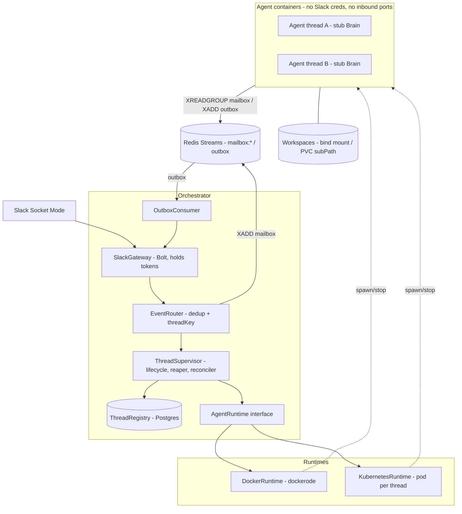
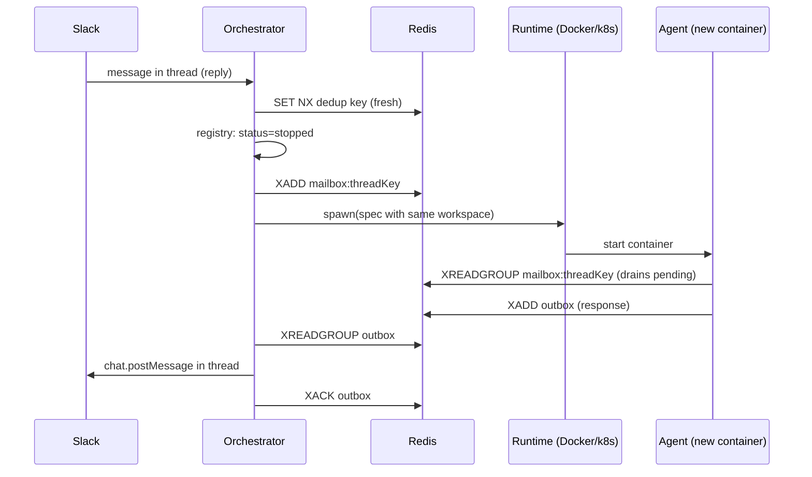

# Cerberus — Container-per-Slack-Thread Orchestrator: Design

**Date:** 2026-07-18
**Status:** Approved
**Source requirements:** `spec.md` (repo root)

## Summary

Cerberus gives every Slack thread its own isolated agent container, managed by a single
privileged orchestrator. The system is an actor model: the **thread** is the durable actor
(identity in Postgres, memory on a workspace volume, mailbox in Redis Streams); the
**container** is its disposable runtime, stopped when idle and transparently recreated on
the next message.

Decisions made during brainstorming:

| Decision | Choice | Alternatives considered |
|---|---|---|
| Agent brain | Stub agent behind a `Brain` interface (real brain, e.g. Claude Agent SDK, swaps in later) | Claude Agent SDK now; Claude Code headless |
| Deployment target | Kubernetes from day one, via a **pluggable runtime** (Docker for local dev, k8s for deployment) | k8s-only; Docker-first-k8s-later |
| Transport | **Redis Streams** per-thread mailboxes + shared outbox | HTTP push (orchestrator owns buffering/retry/discovery, agents expose ports); NATS JetStream (extra infra, Redis still wanted for dedup); gRPC (same reachability problems as HTTP); Unix sockets (impossible across k8s nodes) |
| Persistence | Postgres (registry) + Redis AOF (mailboxes/dedup) + filesystem volumes (workspaces) | SQLite (blocks multi-replica orchestrator); Redis-only registry (weaker durability story) |

Why Redis Streams won: the spec's actor model calls the incoming messages a "mailbox" —
streams make that literal. Agents need **zero inbound networking** (no ports, no service
discovery, no readiness races), messages sent while a container is dead or mid-recreate
simply wait in the stream, and the transport is identical for the Docker and Kubernetes
runtimes (an agent only needs `REDIS_URL`).

## Architecture



### Message flow (happy path)

1. Slack delivers `app_mention` (or a reply in a registered thread) over Socket Mode.
2. **SlackGateway** (Bolt) normalizes it to a domain event.
3. **EventRouter** dedups (`SET NX dedup:slack:<event_id> EX 86400` in Redis) and derives
   `threadKey = <teamId>-<channelId>-<threadTs>` (root `thread_ts`; a top-level mention is
   its own thread root).
4. **ThreadSupervisor** upserts the registry row, updates `lastActivityAt`, and ensures a
   container is running for the threadKey (spawns via the runtime if not).
5. The message is `XADD`-ed to `mailbox:<threadKey>` **regardless of container state**
   (mailbox-first: if spawn takes seconds, the message waits in the stream).
6. The agent consumes via consumer group, processes with its `Brain`, `XADD`s one or more
   responses to the shared `outbox` stream, acks the mailbox entry.
7. **OutboxConsumer** reads `outbox` (consumer group `orchestrator`), posts to the Slack
   thread via the gateway, then acks. Slack posting is guarded by a Redis delivery-guard
   key (`SET NX delivered:<AgentOutbound.id> EX 86400` before calling Slack) so
   at-least-once delivery does not double-post.

### Sequence: wake-up after idle stop



## Actor lifecycle

- **Ensure-running is idempotent and mutex-guarded per threadKey** (in-process async mutex).
  Two rapid mentions never spawn two containers. Recreate after idle stop and first spawn
  are the same code path.
- **Idle reaper** (interval job): threads whose `lastActivityAt` is older than
  `IDLE_TIMEOUT` (default 30 min) get a graceful stop — a `control: shutdown` message plus
  SIGTERM; the agent finishes its current message, acks, exits. Registry row → `stopped`.
  Workspace and mailbox are untouched.
- **Reconciler on orchestrator boot:** list actual containers/pods by label
  (`cerberus.thread-key`), diff against the registry.
  - Row says `running`, container gone → mark `stopped` (wakes on demand).
  - Container exists, no row / unknown → adopt into registry if its labels are valid,
    otherwise stop it.
  - This makes the orchestrator restart-safe and drift self-healing.
- **Graceful orchestrator shutdown:** stop accepting Slack events, finish in-flight outbox
  acks, exit. **Agent containers are left running** — they are independent actors; an
  orchestrator deploy must not kill every conversation. Pending outbox entries are
  delivered on restart (at-least-once + delivery guard).
- **Backpressure:** `MAX_CONCURRENT_AGENTS` caps running containers. At the cap, new
  threads still get registry rows and mailbox entries, but spawn is deferred; the
  orchestrator posts a "queued" notice to the thread. The reaper naturally frees slots.

### Registry states

`provisioning → running → stopping → stopped`, plus `failed` (spawn or runtime error;
retried on next inbound message with exponential backoff recorded on the row).

## Agent protocol (`packages/protocol`)

Zod-validated envelopes; both orchestrator and agent compile against this package.

```typescript
// mailbox:<threadKey> — orchestrator → agent
interface AgentInbound {
  id: string;                         // ULID, correlation id
  threadKey: string;
  kind: 'user_message' | 'control';   // control payload: shutdown | ping
  text?: string;
  user?: { id: string; display: string }; // Slack identity, never credentials
  ts: string;                         // Slack message ts (ordering/audit)
}

// outbox (shared) — agent → orchestrator
interface AgentOutbound {
  id: string;
  inReplyTo: string;                  // AgentInbound.id
  threadKey: string;
  kind: 'message' | 'status' | 'error';
  text: string;
  final: boolean;                     // false = progress update, true = done
}
```

The agent's brain sits behind an interface:

```typescript
interface Brain {
  process(msg: AgentInbound, ctx: BrainContext): AsyncIterable<AgentOutbound>;
}

interface BrainContext {
  threadKey: string;
  workspacePath: string;              // mounted rw at /workspace
  history: AgentInbound[];            // in-memory context for this container's lifetime
}
```

v1 ships `StubBrain` (acknowledges/echoes, maintains in-memory context, persists
`conversation.json` into the workspace). A Claude Agent SDK brain replaces it later with
zero orchestrator changes. Agents publish liveness via `SET heartbeat:<threadKey> EX 30`
on an interval.

## Runtime abstraction

```typescript
interface AgentRuntime {
  spawn(spec: AgentSpec): Promise<AgentHandle>;  // image, threadKey, workspace, limits, env
  stop(handle: AgentHandle, graceful: boolean): Promise<void>;
  list(): Promise<AgentHandle[]>;                // by cerberus label — powers reconciler
  inspect(handle: AgentHandle): Promise<AgentStatus>;
}
```

| Concern | DockerRuntime (local dev) | KubernetesRuntime (deployment) |
|---|---|---|
| API | dockerode over `/var/run/docker.sock` | `@kubernetes/client-node`, namespaced RBAC |
| Unit | container | pod |
| Workspace | bind mount `$WORKSPACES_ROOT/<threadKey>` → `/workspace` | one shared RWX PVC, `subPath: <threadKey>` |
| Identity | container labels + name `cerberus-agent-<hash>` | pod labels + same naming |
| Security | container flags (see below) | `securityContext` + NetworkPolicy |

Per-thread PVCs were rejected: thousands of PVCs strain provisioners; a shared RWX volume
with subPaths scales and keeps the on-disk layout identical to the Docker runtime. The
runtime is selected by config (`RUNTIME=docker|k8s`) and injected into the supervisor.

## Security profile

Applied by both runtimes, translated per backend:

- Read-only root filesystem; tmpfs `/tmp`; writable only at `/workspace`.
- `cap_drop: ALL`; `no-new-privileges` (k8s: `allowPrivilegeEscalation: false`); non-root UID.
- CPU, memory, and PID limits from config.
- **Network:** agents live on an isolated network (compose network / k8s NetworkPolicy)
  that can reach Redis and, once a real brain lands, LLM API egress — nothing else. No
  exposed ports.
- **Credentials:** agents never receive Slack tokens or the Docker socket. Redis ACL: an
  `agent` user restricted to `mailbox:*`, `outbox`, `heartbeat:*` key patterns; the
  orchestrator's user holds full access. (Per-thread ACL users deferred — see scope cuts.)
- Orchestrator is the only privileged component: Slack tokens, Docker socket / k8s RBAC
  (scoped to pod create/delete/list/watch in its own namespace).

## Persistence

| State | Store | Why |
|---|---|---|
| Thread registry (durable actor identity) | Postgres | System of record; survives everything; allows multi-replica orchestrator later |
| Mailboxes, outbox, dedup keys, heartbeats, delivery guards | Redis (AOF enabled) | Fast, TTL-native, streams are the transport |
| Workspace (actor memory) | Filesystem volume / PVC | Spec requirement; survives container destruction |

### Schema (Postgres)

```sql
CREATE TYPE thread_status AS ENUM
  ('provisioning', 'running', 'stopping', 'stopped', 'failed');

CREATE TABLE threads (
  thread_key        TEXT PRIMARY KEY,          -- teamId-channelId-threadTs
  team_id           TEXT NOT NULL,
  channel_id        TEXT NOT NULL,
  thread_ts         TEXT NOT NULL,
  status            thread_status NOT NULL DEFAULT 'provisioning',
  runtime           TEXT NOT NULL,             -- docker | k8s
  container_id      TEXT,
  container_name    TEXT,
  workspace_path    TEXT NOT NULL,
  failure_count     INT NOT NULL DEFAULT 0,
  created_at        TIMESTAMPTZ NOT NULL DEFAULT now(),
  last_activity_at  TIMESTAMPTZ NOT NULL DEFAULT now(),
  updated_at        TIMESTAMPTZ NOT NULL DEFAULT now()
);
CREATE INDEX threads_status_activity_idx ON threads (status, last_activity_at);
```

Streams are capped (`XADD ... MAXLEN ~ 1000` per mailbox, `~ 10000` outbox); the workspace
`conversation.json` is the long-term conversational memory, not the streams.

## Project structure

```
cerberus/
  package.json                 # pnpm workspaces
  packages/
    protocol/                  # shared types, zod schemas, stream/key names
    orchestrator/
      src/
        app.ts  config.ts
        slack/                 # gateway (Bolt), event router
        registry/              # ThreadRegistry interface + Postgres impl
        runtime/               # AgentRuntime, docker/, k8s/
        lifecycle/             # supervisor, idle reaper, reconciler
        mailbox/               # stream producer, outbox consumer
        observability/         # pino logger, prom-client metrics, health
      migrations/
    agent/
      src/
        main.ts                # mailbox consumer loop, heartbeat
        brain/                 # Brain interface, StubBrain
        workspace.ts           # conversation.json persistence
  deploy/
    docker-compose.yml         # orchestrator, redis, postgres, networks
    k8s/                       # manifests: Deployment, RBAC, NetworkPolicy, PVC, Redis, Postgres
  docs/superpowers/specs/
```

Dependency injection: constructor injection wired in `app.ts` (composition root); every
boundary (registry, runtime, mailbox, Slack client, clock) is an interface with a fake for
unit tests. No DI framework — plain constructors.

## Configuration

Zod-validated environment, fail-fast at boot: `SLACK_BOT_TOKEN`, `SLACK_APP_TOKEN`,
`DATABASE_URL`, `REDIS_URL`, `RUNTIME` (`docker|k8s`), `AGENT_IMAGE`, `IDLE_TIMEOUT_MS`
(default 1 800 000), `MAX_CONCURRENT_AGENTS`, `AGENT_CPU_LIMIT`, `AGENT_MEMORY_LIMIT`,
`AGENT_PIDS_LIMIT`, `WORKSPACES_ROOT`, `LOG_LEVEL`. Agent containers receive only:
`THREAD_KEY`, `REDIS_URL` (agent ACL credentials), `WORKSPACE_PATH`, `LOG_LEVEL`.

## Observability

- **Logs:** pino, structured JSON; every line carries `threadKey` and correlation id.
  Runtime captures agent stdout/stderr and re-emits it tagged with the threadKey.
- **Metrics:** prom-client on `/metrics` — active-agents gauge, spawn/stop counters and
  duration histograms, mailbox depth, message latency histogram, Slack API error counter,
  reaper/reconciler activity. `/healthz` (process up) and `/readyz` (Redis + Postgres +
  runtime reachable).

## Failure scenarios

| Failure | Behavior |
|---|---|
| Agent container crashes mid-message | Mailbox entry stays unacked; reconciler/next-message respawns; consumer group redelivers (XAUTOCLAIM on stale pending entries) |
| Spawn fails | Row → `failed`, failure_count++, user-visible error posted to thread; retried with backoff on next message |
| Orchestrator restarts | Reconciler heals registry; unacked outbox entries delivered (delivery guard prevents double posts); Slack Socket Mode resumes |
| Redis down | Orchestrator `/readyz` fails; Slack events are not acked → Slack retries; agents block on reads and recover on reconnect |
| Postgres down | Same readiness gate; no state transitions occur until back |
| Duplicate Slack event | Dedup key rejects it |
| Slack retry storm after outage | Dedup + mailbox-first absorb it; MAX_CONCURRENT_AGENTS caps spawn burst |
| Workspace volume full | Spawn/write errors surface as `failed` rows + error posts; ops alert via metrics |

## Testing strategy

- **Unit (vitest):** router dedup, threadKey derivation, supervisor state transitions,
  reaper/reconciler decisions — against in-memory fakes of every interface.
- **Integration (vitest + testcontainers):** real Redis + Postgres + real Docker spawning
  the stub agent image; synthetic Slack events injected at the gateway boundary (Slack
  client mocked); assertions on outbox → Slack calls; kill containers mid-conversation and
  assert recovery.
- **E2E:** the existing Slack app in a test channel; scripted smoke checklist.

## Scaling & future work

- Agents already scale horizontally (they are pods/containers).
- Orchestrator is single-replica in v1. Designated scale-out path (documented, not built):
  partition threadKeys across replicas by consistent hash; registry in Postgres and
  mailboxes in Redis already support this.
- Kubernetes is a first-class runtime from day one, so there is no "migration" — only
  hardening (Helm chart, HPA for the orchestrator, external Redis/Postgres).

## Deliberate scope cuts (v1)

- No Postgres message-audit table (streams + workspace `conversation.json` cover it).
- No per-thread Redis ACL users (single restricted `agent` ACL role).
- No orchestrator multi-replica / leader election.
- No token-level streaming to Slack (agents send `final: false` progress messages instead).
- No real LLM brain (StubBrain proves the architecture; `Brain` interface is the seam).
