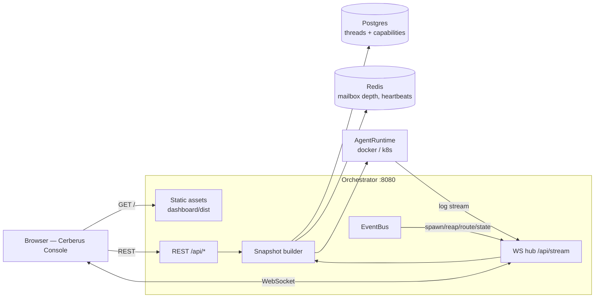

# Cerberus Console — Agent Monitoring Dashboard: Design

**Date:** 2026-07-19
**Status:** Approved
**Builds on:** `docs/superpowers/specs/2026-07-18-cerberus-design.md` (the orchestrator this monitors)

## Summary

A web console for watching the live agent fleet: which threads have running containers, what state each is in, drill-down into a single agent, streaming raw container logs, and a per-agent capability configuration panel that is **mocked** (persisted, not enforced) pending a real agent brain.

Decisions made during brainstorming:

| Decision | Choice | Alternatives considered |
|---|---|---|
| Deployment | Served by the orchestrator on its existing port 8080 | Separate dashboard service (duplicates credentials, second privileged component); TUI (not shareable, not visual) |
| Liveness | Everything over one WebSocket — event-pushed plus a 2s reconcile tick | Polling + SSE logs; manual refresh |
| Capabilities mock | Tool toggles + resource limits + model picker, persisted to Postgres | Tool toggles only; raw JSON editor |
| Visual direction | Dark ops console (Vercel/Linear/Grafana lineage) | Light product UI; theme-toggled both |

The orchestrator is already the only component holding the registry, the Docker socket, and Redis. Putting the console there means no new credentials, no new container, and no cross-service consistency problem — the console reads exactly what the orchestrator already knows.

## Architecture



### Live data flow

The browser opens one WebSocket to `/api/stream` and subscribes to channels:

| Channel | Payload | Lifecycle |
|---|---|---|
| `overview` | Fleet counts + one `AgentSummary` per thread | Snapshot on subscribe, then deltas |
| `thread:<threadKey>` | Full `AgentDetail` incl. conversation + capabilities | Snapshot on subscribe, then deltas |
| `logs:<threadKey>` | Raw container log lines | Starts a follow stream; torn down on unsubscribe/disconnect |

Two push triggers, deliberately combined:

1. **Real events** — `ThreadSupervisor`, `IdleReaper`, `Reconciler`, and `EventRouter` publish to an in-process `EventBus` (spawned, reaped, state-changed, message-routed, reply-posted). The hub fans these out to subscribed clients immediately.
2. **A 2-second reconcile tick** — refreshes derived state the orchestrator doesn't emit events for (container status drift, mailbox depth, heartbeat freshness). Without it, a container dying outside the orchestrator's control would show stale forever.

The hub only builds snapshots for channels that currently have subscribers; with no console open, the tick costs nothing.

### Log streaming

`AgentRuntime` gains one method so log access stays runtime-agnostic:

```typescript
logs(handle: AgentHandle, opts: { tail: number; follow: boolean; signal: AbortSignal }): AsyncIterable<string>;
```

- **DockerRuntime:** `container.logs({ follow, stdout: true, stderr: true, tail })`, demultiplexing Docker's stream framing into lines.
- **K8sRuntime:** `readNamespacedPodLog` with `follow`.

The hub owns one stream per `(client, threadKey)` pair and aborts it on unsubscribe, socket close, or agent stop.

## Screens

**1. Overview.** A stat strip (active agents, threads today, messages in/out, reaped) above a responsive grid of agent cards. Each card: thread identity (channel + short ts), status pill, uptime, message count, and a heartbeat dot that pulses when the agent's `heartbeat:<threadKey>` key is fresh (<30s) and goes hollow when stale. Cards are keyboard-focusable and open the detail view.

**2. Agent detail.** Header with thread key, status, and stop/restart affordances (stop is real — it calls the runtime; restart re-runs `ensureRunning`). Below: identity block (container id/name, image, workspace path, created/last-activity), a lifecycle timeline built from registry timestamps and recent events, the conversation history read from the workspace `conversation.json`, and the capabilities panel.

**3. Log drawer.** Slides over the detail view. Monospace, auto-scrolling, with pause/resume, a substring filter, tail-size selector (100/500/1000), and copy-all. Pausing buffers rather than dropping, so resuming doesn't lose lines.

## Capabilities (mocked)

```sql
CREATE TABLE thread_capabilities (
  thread_key   TEXT PRIMARY KEY REFERENCES threads(thread_key) ON DELETE CASCADE,
  tools        JSONB NOT NULL DEFAULT '{}'::jsonb,   -- {"web_search": true, "code_execution": false, ...}
  model        TEXT  NOT NULL DEFAULT 'stub',
  cpu          NUMERIC(4,2),
  memory_mb    INT,
  pids_limit   INT,
  updated_at   TIMESTAMPTZ NOT NULL DEFAULT now()
);
```

`GET /api/threads/:key/capabilities` returns stored values or defaults derived from the orchestrator config; `PUT` validates against a zod schema and upserts. The panel renders a persistent banner — **"Configuration preview — not yet enforced by the runtime"** — because a control that silently does nothing is worse than no control. When a real brain lands, the supervisor reads this table when building `AgentSpec` and the banner comes down.

## API surface

| Method | Path | Purpose |
|---|---|---|
| GET | `/api/overview` | Fleet snapshot (also the WS `overview` payload) |
| GET | `/api/threads` | Agent summaries |
| GET | `/api/threads/:key` | Agent detail |
| GET | `/api/threads/:key/logs?tail=N` | Non-streaming log tail (fallback / copy) |
| GET | `/api/threads/:key/capabilities` | Stored or default capabilities |
| PUT | `/api/threads/:key/capabilities` | Upsert capabilities (only mutating route besides stop/restart) |
| POST | `/api/threads/:key/stop` | Graceful stop via runtime |
| POST | `/api/threads/:key/restart` | `ensureRunning` for the thread |
| WS | `/api/stream` | Subscribe/unsubscribe channels |

`/healthz`, `/readyz`, `/metrics` keep their current paths and behavior.

## Project structure

```
packages/protocol/src/dashboard.ts        # AgentSummary, AgentDetail, OverviewSnapshot, WS envelopes (zod)
packages/orchestrator/src/api/
  server.ts        # mounts static + REST + WS upgrade on the existing health server
  routes.ts        # REST handlers
  hub.ts           # WS subscription hub, per-client channel state, log stream ownership
  events.ts        # EventBus (typed EventEmitter) + event types
  snapshots.ts     # builds snapshots from registry + runtime + redis
  static.ts        # static file serving with correct MIME types + SPA fallback
packages/orchestrator/src/registry/capabilities-repo.ts
packages/orchestrator/migrations/0002_capabilities.sql
packages/dashboard/
  index.html  vite.config.ts  tailwind.config.ts  package.json  tsconfig.json
  src/main.tsx  src/App.tsx  src/styles.css
  src/lib/{ws.ts,api.ts,format.ts}
  src/components/{OverviewBar,AgentGrid,AgentCard,StatusPill,HeartbeatDot,AgentDetail,LifecycleTimeline,ConversationView,CapabilityPanel,LogDrawer}.tsx
```

Existing lifecycle components take the `EventBus` as an optional constructor dependency, so their current tests and behavior are unchanged when it is absent.

## Configuration

New env vars, both optional: `DASHBOARD_ENABLED` (default `true`) and `DASHBOARD_TOKEN` (default empty). When the token is set, REST requests need `Authorization: Bearer <token>` and the WS handshake needs it as a query parameter; when empty, the console is open — acceptable because compose binds 8080 to localhost, and the README will say plainly not to expose it without a token.

## Security

- The console inherits the orchestrator's privileges; it must never be exposed publicly without `DASHBOARD_TOKEN`. Documented in the README's security section and beside the compose port mapping.
- Log output may contain user message text — it is thread content, already visible to anyone who can read the Slack channel, but the README notes that log access equals conversation access.
- Static serving resolves paths against the dist root and rejects traversal; SPA fallback only serves `index.html`, never an arbitrary file.
- No Slack tokens or Redis credentials are ever included in a snapshot payload.

## Failure scenarios

| Failure | Behavior |
|---|---|
| WebSocket drops | Client reconnects with exponential backoff (1s→15s), re-subscribes its channels, and shows a "reconnecting" state rather than stale-but-confident data |
| Runtime unreachable (Docker down) | Snapshots mark container state `unknown` and the UI shows a degraded banner; registry data still renders |
| Log stream ends (container exits) | Stream closes cleanly with an end-of-stream marker in the drawer; no reconnect loop |
| Capabilities PUT for an unknown thread | 404 rather than creating an orphan row (FK would reject it anyway) |
| Dashboard assets missing from the image | `/` returns a clear 503 explaining the build step; API and health endpoints still work |

## Testing strategy

- **Unit (vitest):** snapshot builders against fake registry/runtime/redis; hub subscribe/unsubscribe/broadcast and log-stream teardown; REST handlers incl. auth and 404 paths; capabilities zod validation.
- **Integration:** capabilities repo against real Postgres (testcontainers); Docker log streaming against a real container.
- **Browser:** drive the running console against the live stack — spawn a thread from Slack, watch it appear, open logs, toggle a capability, reload and confirm persistence.

## Scope cuts (v1)

- No historical charts or metrics time series (Prometheus already exposes the data).
- No authentication beyond the optional shared token; no user accounts.
- No log search across agents; the filter is per-drawer substring.
- Capabilities are stored and displayed only — the runtime does not read them yet.
- No mobile-optimized layout beyond the grid reflowing; this is a desktop ops tool.
